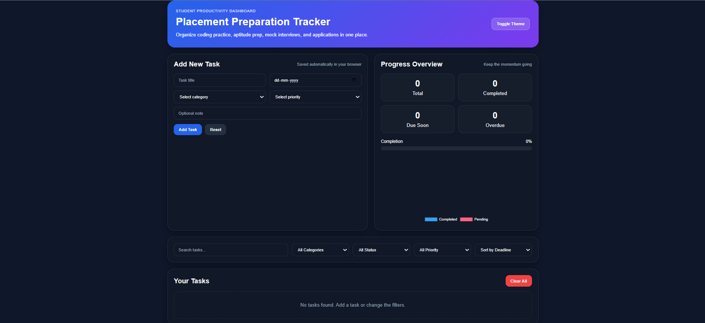
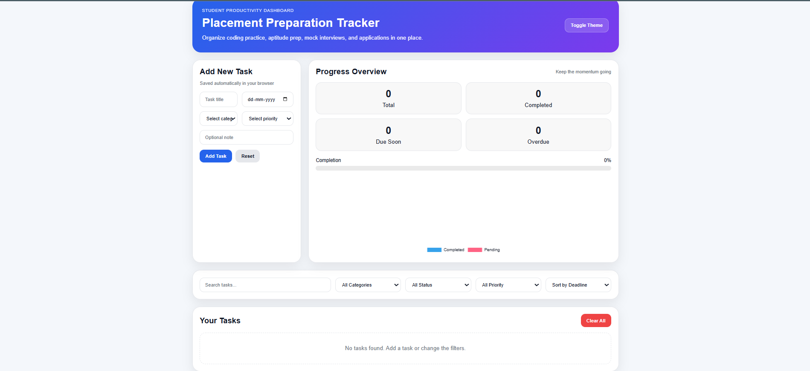

# 📊 Placement Preparation Tracker

A responsive web-based dashboard to organize and track placement preparation including coding practice, aptitude, mock interviews, and applications.

## 🚀 Features
- Add, edit, delete tasks
- Category-based filtering (Coding, Aptitude, etc.)
- Priority levels (High, Medium, Low)
- Deadline tracking (Due soon / Overdue detection)
- Progress analytics with charts
- Search and sorting functionality
- Dark mode support
- Data persistence using localStorage

## 🛠 Tech Stack
- HTML
- CSS
- JavaScript
- Chart.js

## 📷 Preview

## 🌐 Live Demo
https://daksh2405.github.io/Placement-Preparation-Tracker/

## 📌 How to Run
1. Download the project
2. Open `index.html` in browser

---

## 💡 Future Improvements
- User authentication
- Backend integration
- Cloud storage
- Mobile app version
